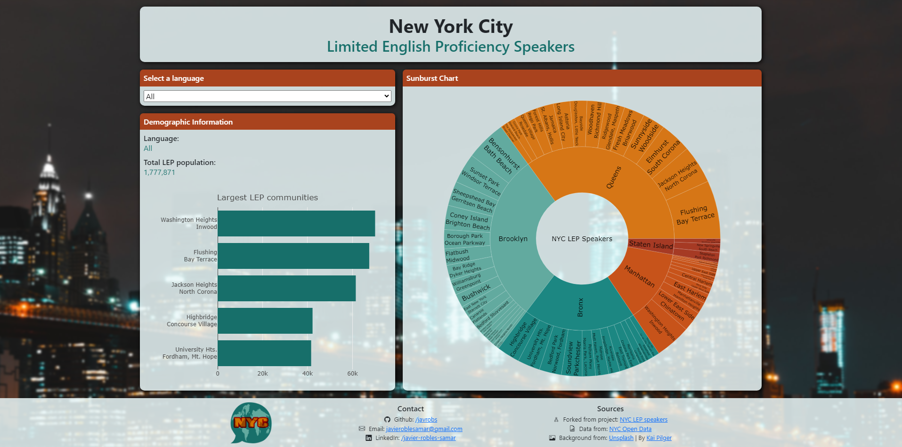
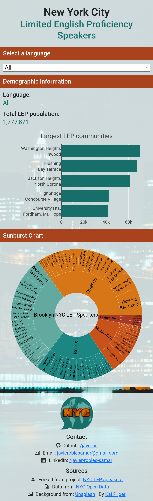

# Languages of the Limited English Proficient (LEP) Speakers by Community District in NYC
## Introduction
We created interactive visualizations that show the total quantity of speakers with a limited English proficiency what is their native language and what community district they live in.  
## Source
- Contains information about the total amount of speakers of a number of languages in each of NYC's community districts. JSON URL:  
[NYC Open Data - LEP Speakers](https://data.cityofnewyork.us/City-Government/Population-and-Languages-of-the-Limited-English-Pr/ajin-gkbp)
## Results
The screenshot below shows a preview of the final result.
- Desktop version:  

- Mobile version:  

## Authors (original project)
- Javier Robles - [LinkedIn](https://www.linkedin.com/in/javier-robles-samar/) (me)
- Marijose Cavazos - [LinkedIn](https://www.linkedin.com/in/marijose-cavazos-b2a353110/)
- Alejandra Espinosa - [LinkedIn](https://www.linkedin.com/in/z-ale-espinosa/)
- Aldo Silva - [LinkedIn](https://www.linkedin.com/in/aldoslv/)
